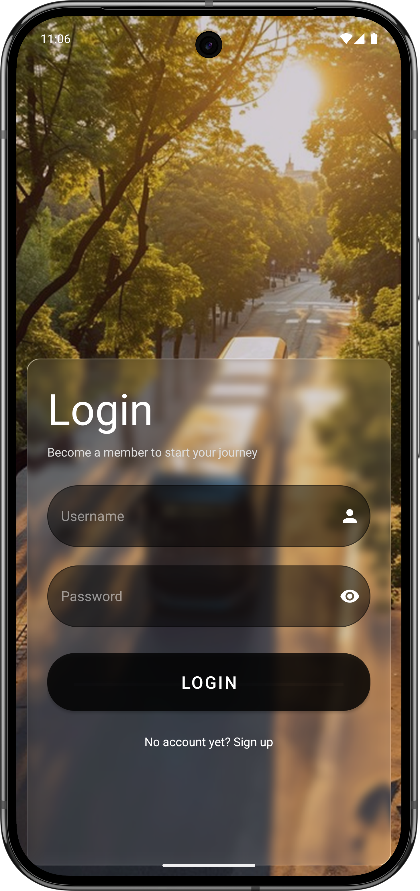
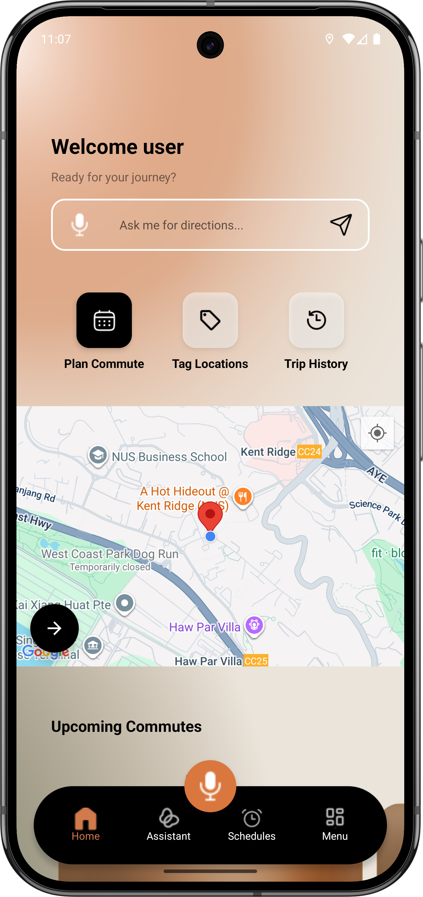
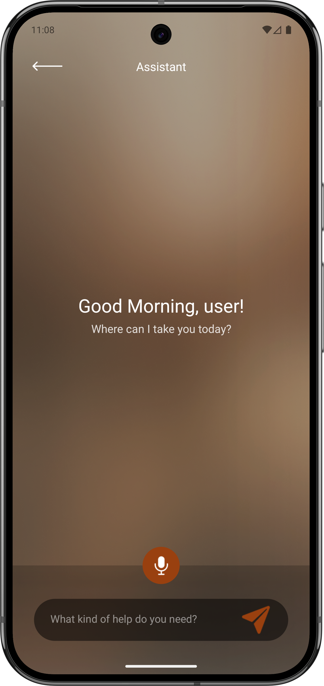
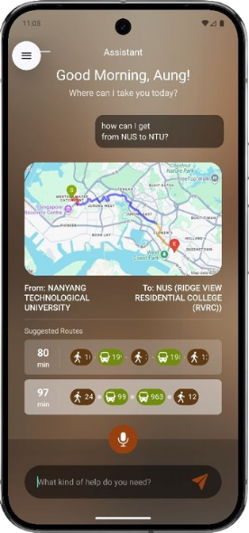
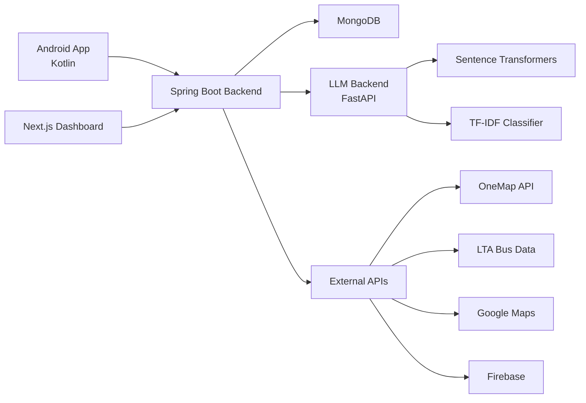
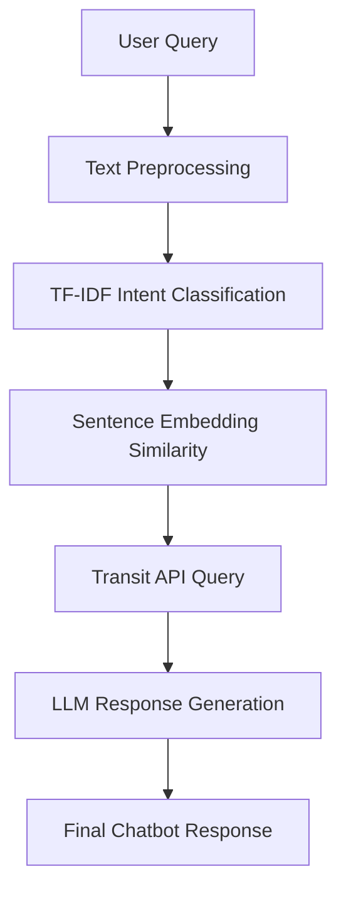

# Nimbus 🚌
### AI-Powered Public Transport Companion


Nimbus is an **AI-powered public transportation assistant** designed to help commuters navigate Singapore’s transit network using **natural language queries, real-time bus data, and intelligent route planning**.

This project demonstrates a **full-stack distributed architecture** integrating:

- Mobile application
- Web dashboard
- Microservice backend
- AI/NLP inference service
- DevOps infrastructure

Built as part of the **NUS Graduate Diploma in Software Analytics (GdipSA)**.

---

# 🚀 Demo

## Mobile App

<p align="center">




</p>

<!-- ---

## Web Dashboard

<p align="center">

</p>

--- -->

# ✨ Features

## 🤖 AI Transit Chatbot

Users can ask transit questions in **natural language**.

Examples:

```text
"When is the next bus from Kent Ridge MRT?"
"How do I get to Orchard Road?"
"What buses arrive at this stop?"
```

Capabilities:

- Intent classification using **TF-IDF**
- Semantic similarity via **Sentence Transformers**
- Multi-user conversation handling
- LLM-powered fallback responses
- Integration with transit APIs

---

## 🗺️ Smart Route Navigation

- Real-time GPS navigation
- Bus arrival predictions
- Route planning with transit APIs
- Offline map styling
- Voice guidance

---

## 📱 Android Mobile App

Key modules:

- Home dashboard
- Smart route planner
- Chatbot interface
- Saved locations
- Trip history
- Push notifications

Built using **clean architecture with Kotlin modules**.

---

## 💻 Admin Web Dashboard

Provides operational insights:

- User analytics
- Chatbot interaction monitoring
- Feedback tracking
- System metrics dashboard
- Real-time health monitoring

---

# 🏗 System Architecture



---

# 🧠 AI / NLP Pipeline

The chatbot uses a **hybrid AI pipeline** designed for speed and reliability.



### Why Hybrid?

Instead of relying entirely on LLMs:

- **TF-IDF classifier** handles common queries efficiently
- **Embeddings** detect semantic similarity
- **LLM fallback** handles edge cases

This design reduces latency and improves reliability.

---

# 🛠 Technology Stack

## Mobile
- Kotlin
- Android SDK
- Google Maps SDK
- Retrofit
- Firebase Cloud Messaging

## Backend
- Spring Boot 3
- Java 17
- MongoDB Reactive
- Spring Security
- JWT Authentication

## AI Service
- FastAPI
- Sentence Transformers
- scikit-learn
- GPT4All (local inference)

## Web Dashboard
- Next.js 15
- TypeScript
- TailwindCSS
- React Context

## DevOps
- Docker
- Terraform
- Ansible
- GitHub Actions
- Prometheus
- Grafana
- SonarCloud

---

# 📂 Project Structure

```text
nimbus/
│
├── android-kotlin/      # Android mobile application
├── spring-backend/      # Spring Boot API server
├── llm-backend/         # FastAPI NLP service
├── next-frontend/       # Next.js admin dashboard
│
├── infrastructure/
│   ├── terraform/
│   └── ansible/
│
├── docker-compose.yml
└── .github/images/
```

---

# ⚙️ Running the Project

### Clone Repository

```bash
git clone https://github.com/yourusername/nimbus.git
cd nimbus
```

### Start Services

```bash
docker-compose up --build
```

Services started:

| Service | Port |
|------|------|
Spring Backend | 8080
LLM Backend | 8000
Next.js Dashboard | 3000

---

# 📊 Observability

Nimbus includes built-in monitoring tools.

- **Prometheus metrics**
- **Spring Actuator health checks**
- **Structured logging**
- **Grafana dashboards**

These provide visibility into:

- API latency
- chatbot usage
- system performance
- service health

---

# 🔄 CI/CD Pipeline

GitHub Actions pipeline automatically runs:

- Unit tests
- Integration tests
- SonarCloud code quality analysis
- Dependency vulnerability scanning
- Docker image builds
- Deployment workflows

Quality gates:

- Test coverage > 80%
- No critical vulnerabilities
- Maintainability rating A

---

# ⚡ Engineering Challenges

### Designing an AI Chatbot Without Full LLM Dependency
Instead of using only large language models, the system uses a **hybrid NLP pipeline** combining classical ML and embeddings for lower latency.

### Real-Time Transit Data Integration
Transit APIs often introduce latency or incomplete data. The system implements fallback strategies and caching.

### Multi-Service Architecture
The system coordinates **four separate services**:

- Android client
- Spring backend
- AI inference service
- Web admin dashboard

### Mobile + AI + Backend Integration
Ensuring reliable communication between:

- mobile clients
- REST APIs
- AI inference pipelines

---

# 👨‍💻 Contributors

Developed by **GdipSA60 Team 5 — National University of Singapore**

- Phyo Nyi Nyi Paing
- Aung Myin Moe
- Muhammad Haziq Bin Jamil
- Li Xing Bang

---

# 📄 License

Educational project developed as part of the **NUS Graduate Diploma in Software Analytics**.

---

# ⭐ If You Like This Project

Consider starring the repository!
